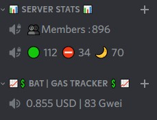

# BAT ETH GAS tracker bot for Discord
A bot for Discord to keep track of Basic attension token price and ETH gas fees. It changes a voice channel name every five minutes (ratelimit of DS) with data from Coingeko e Gasnow.

